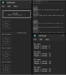
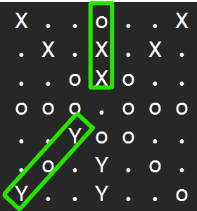

# Morabaraba Algorithm

This program simulates the traditional game of Morabaraba between two algorithms. The game involves two players, Player 1 and Player 2, who take turns placing and moving their cows on the board.

## Game Setup

The number of starting cows is determined by reading an input file called `startingCows.txt`. This file should specify the desired number of starting cows for each player.

## Game Progression

The game progresses through two main phases: the placement phase and the movement phase.

### Placement Phase

1. Player 1 begins by placing one of its cows on an empty intersection point of the board.

2. Player 2 follows by placing one of its cows on an empty intersection point.

3. The players continue taking turns placing their cows until all cows have been placed on the board.

### Movement Phase

4. Once all cows have been placed, the movement phase begins.

5. Players take turns moving their cows along the lines on the board to adjacent empty intersection points.

6. The game ends when one player has only two cows remaining, making them unable to form a mill, or when one player has no legal moves left.

#### Flying Phase

If a player is reduced to only three cows remaining on the board, the player enters the flying phase. During this phase, the player can "fly" cows to any vacant slots on the board, not just adjacent slots.

### Goal

The goal for each player is to form "mills" by placing three of their cows in a straight line. When a mill is formed, the player can remove one of its opponent's cows from the board. However, cows that are part of a mill cannot be removed unless all cows are in mills.

## Players

- **Player 1**: This algorithm is smart and strategic. It uses a search algorithm to analyze the board to make the best possible moves based on the current game state.

  During the placement phase, Player 1 strategically assesses the board to identify free slots for its cows. It prioritizes placing cows near previously placed ones and looks for potential mills—alignments of two cows with an open slot for a third. Player 1 aims to form mills to attack Player 2 or block potential mills for the opponent.

  In the movement phase, Player 1 uses a spider-insect algorithm. It identifies potential mills and designates an "insect" as the target slot that will result in a mill. The algorithm moves nearby cows, "spiders," closer to the target. If no suitable move is available, random movement is used. To avoid repetitive moves and illegal mills, the algorithm discourages selecting recently moved cows. When a valid mill is formed, Player 1 attacks.

  
   
  Caption: This image shows a potential mill.

- **Player 2**: This algorithm makes random moves without any specific strategy, serving as a simple opponent for Player 1.

## Output Files

The program generates the following files:

- `morabarabaResults.txt`: This file contains the game data, including the moves made by each player, the mills formed, and the winner of the game.

- `boardLog.txt`: This file provides a visual representation of the board after each move, aiding in understanding the progression of the game visually.

- `statsLog.txt`: This file contains key statistics related to the game that can be analyzed for further insights.

### Note from the Developer

I successfully developed a functional Morabaraba game simulation as a semester project for my software development course. Although I am relatively new to programming in C++, I dedicated my best efforts to create this program. Any feedback or suggestions for improvements are welcome.

Before running the program, please ensure that you have the `startingCows.txt` file in the same directory as the `.h` files and `.cpp` files.
